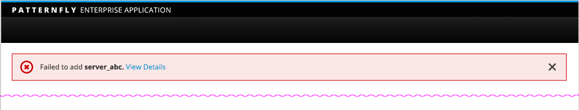
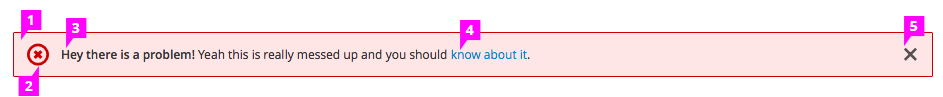

# Alert/Inline Notification
Inline notifications are used to notify a user of the status of an action during a task flow.

  This is a primary alert—check it out!

  This is a secondary alert—check it out!

  This is a success alert—check it out!

  This is a danger alert—check it out!

  This is a warning alert—check it out!

  This is a info alert—check it out!

  This is a light alert—check it out!

  This is a dark alert—check it out!

## Usage
Use an inline notification when you want to call attention to a particular condition that does not necessarily block the user from performing other actions (in that case you should use a modal alert). Alerts will persist until the user either closes the alert of navigates to a new page.

It is recommended that inline notifications are shown at the top of the main content area.

## Design

1. Background: The notification should occupy the full width of the main content area. See the In Context example.
2. Icons: Indicate the type of the notification. There are four types of available notifications: info, success, warning and error.
3. Message: Show a short message within the notification and make it clear what just happened or what the user needs to perform next.
 * Bold the important information (e.g. name of the object).
 * Use the regular font weight for the rest of the message.
5. Link (optional): Show a “View Details” link to allow the user to navigate to details of the message.
6. Close (optional): Allow the user to dismiss the inline notification by clicking on the Close icon.
